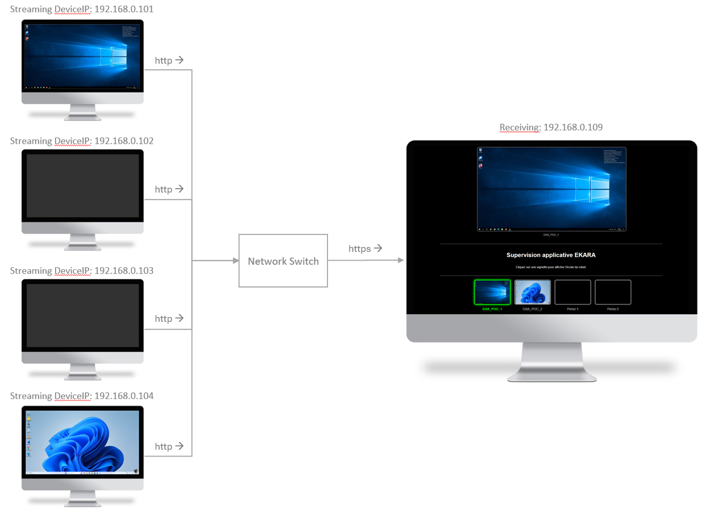

# Ekara-Streaming

 

## Description
Streaming solution for broadcasting Ekara robot screens to a real-time monitoring console.

Streaming solution developed by [ip-label](https://ip-label.com/).

## Screens

## Architecture

## Requirements

-|version
--|:--:
Private robot|>=1
EkaraStreamer_v2.exe|>=2

## Download

[github-download]: (https://github.com/MrGuyTwo/Ekara-Streaming/releases/tag/Ekara-Streaming_v1)
 - [`Ekara-Streaming`][github-download]

## Instalation

On each Ekara robot:
- Create a local folder
- Copy the files below to the local folder
    - “EkaraStreamer_v2.exe”
    - “Desktop_wallpaper_1.jpg”
    - “ekara_colors_eagle(80).png”
    - “Stream - Vignette.html”
    - “stream_Mosaic_4.html”

- Modify the "Run_Stream_Robot.cmd" script to your context (Folder of “EkaraStreamer_v2.exe”)
- Modify the HTML pages according to your context (URL of robots / ports / ...)
- Copy the "Run_Stream_Robot.cmd" file to the "startup" folder of the user profile configured in the robot session startup. ((Win-key + R) shell:startup)

EkaraStreamer_v2.exe 
	usage: EkaraStreamer_v2.exe [-h] [--framerate FRAMERATE] [--port PORT] [--monitor MONITOR]

